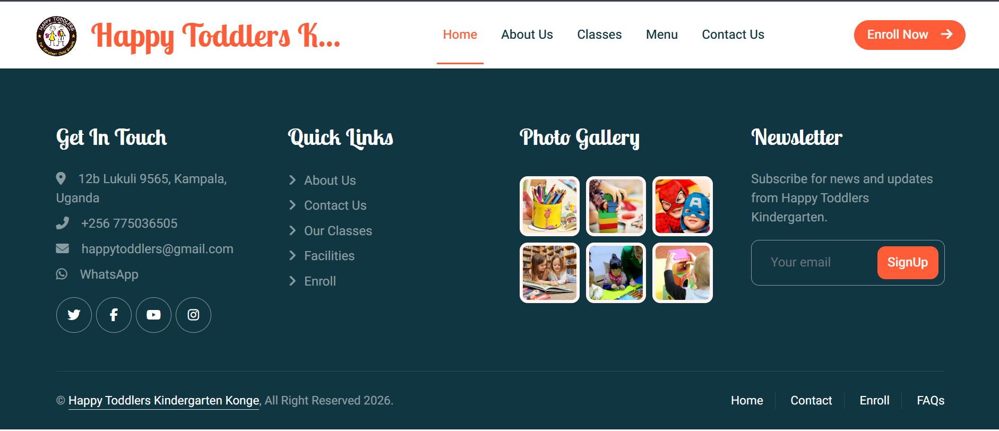
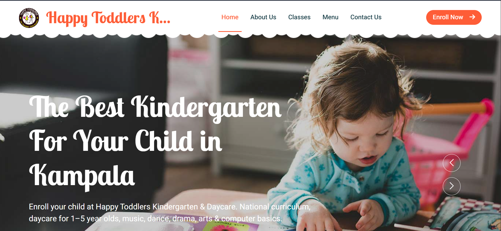
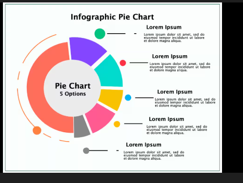
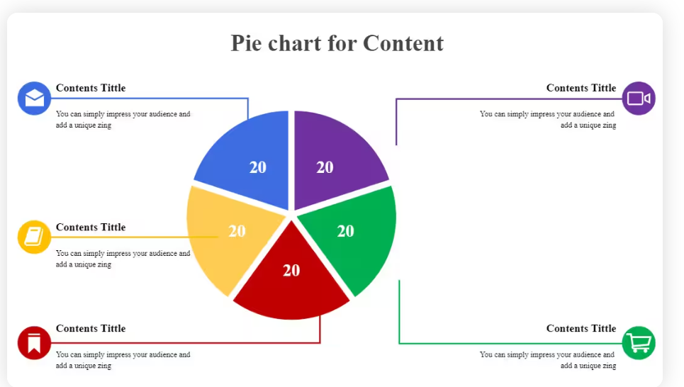

# CodeQueen 👑

**Aspiring AI & Data Science Engineer • Frontend Learner • Ophthalmologist @ Mengo Hospital**

  
  
  

---

### About CodeQueen

- 🧠 **Hardworking & curious** — loves writing code and learning new tech
- 📚 **Learning**: HTML, CSS, JavaScript, Python, Data Science, AI & Machine Learning
- 🎬 **Coming soon**: YouTube live streams — tech trends, tutorials & learning journeys
- 📖 **Loves**: reading books, typing stories
- 👁️ **By day**: Ophthalmologist at Mengo Hospital

---

### Tech Stack

**AI / Data Science libraries:** NumPy, Pandas, Matplotlib, Seaborn, scikit-learn, TensorFlow, PyTorch (basics)

---

### Featured Projects

<table>
  <tr>
    <td align="center" width="50%">
      
       
      <strong>Kindergarten Website</strong>
       
      <em>HTML • CSS • JavaScript</em>
    </td>
    <td align="center" width="50%">
      
       
      <strong>Kindergarten Hero Section</strong>
       
      <em>Web • Responsive Layout</em>
    </td>
  </tr>
  <tr>
    <td align="center" width="50%">
      
       
      <strong>Infographic Pie Chart</strong>
       
      <em>Python • Matplotlib • Data Viz</em>
    </td>
    <td align="center" width="50%">
      
       
      <strong>Pie Chart for Content</strong>
       
      <em>Python • Data Visualization</em>
    </td>
  </tr>
</table>

---

### GitHub Stats

---

### Get in Touch

- 📘 [Facebook](https://www.facebook.com/profile.php?id=61582286030019)
- 💻 [GitHub](https://github.com/codequeenyvonne-cpu)
- 🎥 YouTube — *Live streams coming soon*

---

  <strong>CodeQueen — Building in public ✨</strong>

